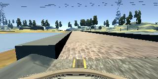

# **Behavioral Cloning** 

## Writeup Template

### You can use this file as a template for your writeup if you want to submit it as a markdown file, but feel free to use some other method and submit a pdf if you prefer.

---

**Behavioral Cloning Project**

The goals / steps of this project are the following:
* Use the simulator to collect data of good driving behavior
* Build, a convolution neural network in Keras that predicts steering angles from images
* Train and validate the model with a training and validation set
* Test that the model successfully drives around track one without leaving the road
* Summarize the results with a written report


[//]: # (Image References)

[image1]: ./examples/placeholder.png "Model Visualization"
[image2]: ./examples/placeholder.png "Grayscaling"
[image3]: ./examples/placeholder_small.png "Recovery Image"
[image4]: ./examples/placeholder_small.png "Recovery Image"
[image5]: ./examples/placeholder_small.png "Recovery Image"
[image6]: ./examples/placeholder_small.png "Normal Image"
[image7]: ./examples/placeholder_small.png "Flipped Image"

## Rubric Points
### Here I will consider the [rubric points](https://review.udacity.com/#!/rubrics/432/view) individually and describe how I addressed each point in my implementation.  

---
### Files Submitted & Code Quality

#### 1. Submission includes all required files and can be used to run the simulator in autonomous mode

My project includes the following files:
* `train.py` containing the script to create and train the model
* `drive.py` for driving the car in autonomous mode
* `model.h5` containing a trained convolution neural network 
* `README.md` containing the writeup

#### 2. Submission includes functional code
Using the Udacity provided simulator and my drive.py file, the car can be driven autonomously around the track by executing 
```sh
python drive.py model.h5
```

#### 3. Submission code is usable and readable

The `train.py` file contains the code for training and saving the convolution neural network. The file shows the pipeline I used for training and validating the model, and it contains comments to explain how the code works.

### Model Architecture and Training Strategy

#### 1. An appropriate model architecture has been employed

Initially, I used LeNet but this was not very good. I decided to implement Nvidia's model from their [End-to-End Deep Learning for Self-Driving Cars](https://devblogs.nvidia.com/deep-learning-self-driving-cars) paper. This gave a much better result with the same data as LeNet.

#### 2. Attempts to reduce overfitting in the model

I did image flipping to reduce overfitting in the model. I did not use any dropout layers because it didn't seem to be required to get a full lap of the track.

#### 3. Model parameter tuning

The model uses an adam optimizer, so the learning rate was not tuned manually.

The number of epochs was tuned, initially this was set to 10, then was brought down to 5, then 3, then back up to 5. This was based purely by comparing the training accuracy and validation accuracy glidepaths.

#### 4. Appropriate training data

The model was trained and validated on a lot of data. I performed the following data collection runs:
- Normal drive around the track in the centre
- Recovery training by parking the car at the edge of the track, putting full steering input towards the centre of the track and recording a short clip
- Specific data collection around problematic areas (e.g. hairpin bend and bridge) and additional recovery training at these sections

### Model Architecture and Training Strategy

#### 1. Solution Design Approach

The overall strategy for deriving a model architecture was to re-use what the experts have already demonstrated to work (the Nvidia model). The first autonomous drive with this model was already able to drive the car about 1/3 around the track before coming off, and this was using only the 'perfect lap' training set before additional data collection runs.

As this network was already performing very well on basic data, I knew that it was just a matter of collecting more data to improve the model performance. After switching to the Nvidia network, I did not modify the model at all.

The data was split into training and validation sets using built-in Keras functionality. The training and validation accuracy during the training process helped me to tune the number of epochs to minimize the validation loss.

To combat overfitting, I did data augmentation by flipping the images horizontally. This on its own improved the model dramatically, going from 1/3 around the track to 2/3 around the track.

I did some additional data collection around the problematic areas to teach the model how to recover to the center of the track. After a few of these iterations, the car was going around the track by itself with no problems.

#### 2. Final Model Architecture

The final model architecture is identical to [Nvidia's model](https://devblogs.nvidia.com/deep-learning-self-driving-cars):


I made no changes to this, and it worked extremely well out of the box.

#### 3. Creation of the Training Set & Training Process

To capture good driving behavior, I first recorded two laps on track one using center lane driving. Here is an example image of center lane driving:


After testing the model, I then did recovery examples. Given the way that the model is set up (it outputs steering angle), it is enough to park the car on the side of the track, turn the wheels fully to the center and record a short clip without driving forwards.

Examples:


Wheels: fully to the left (-25 degrees)


Wheels: fully to the left (-25 degrees)


Wheels: fully to the right (+25 degrees)


Wheels: fully to the right (+25 degrees)

The network learns that in these cases, the wheels should turn towards the center of the track. The car does not need to be moving to demonstrate this to the network because it is training on static images, without using speed input.

In total, about 3000 images were collected (left, right and center) which were augmented by flipping (= 6000 images)

The model was trained on about 5000 training examples and validated on about 1000 examples (80/20 split after shuffling the data)

### 4. Final output
[Here is a link to the video](run1.mp4) of the car driving itself around the track